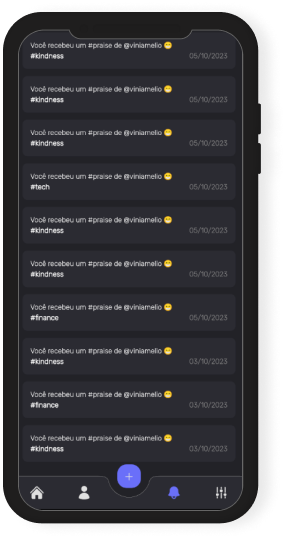

# Surpraise Client

 
 

 
 

Surpraise é uma rede social com a única e exclusiva finalidade de enviar #praises para as pessoas. Valorizá-las, seja por trabalhos executados por ela, por sua convivência agradável, ou mesmo, por aquela ajuda imprescindível.

## Sobre o projeto
Client mobile, desenvolvido em Flutter, utilizando da técnica de multi-repo para compor as camadas arquiteturais do app: <a href="https://github.com/viniciusamelio/surpraise_core">Surpraise Core</a> e <a href="https://github.com/viniciusamelio/surpraise_infra">Surpraise Infra</a>.

## Screenshots

